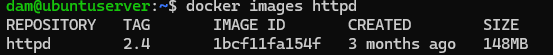

# Tarea 3 SXE -- Pedro Piñeiro
## 1. Descarga la imagen 'httpd' y comprueba que está en tu equipo
### Para descargar la imagen (concretamente la version 2.4) usamos
```
docker pull httpd:2.4
```

### Comprobamos que la imagen está en nuestro equipo con
```
docker images httpd
```

## 2. Crea un contenedor con el nombre 'dam_web1'
### Lo creamos con
```
docker run -d --name dam_web1 httpd:2.4 
```
### Comprobamos que se ha creado con
```
docker ps
```


